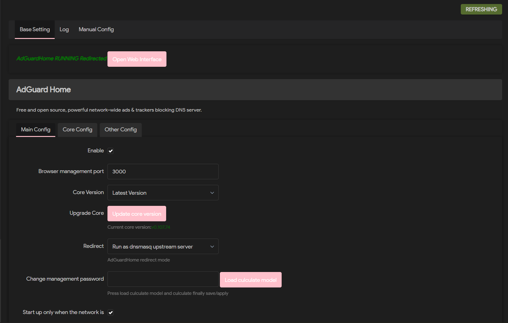

[English](README.md) | [简体中文](README_ZH.md) | [日本語](README_JA.md) | [한국어](README_KR.md)

# luci-app-adguardhome



OpenWrt LuCI 向け AdGuardHome プラグイン。無料かつオープンソースで、ネットワーク全体の広告およびトラッカーをブロックする強力な DNS サーバー。

## 機能

- ネットワーク全体の広告およびトラッカーブロック
- GFW リストのインポート対応
- コアの自動/手動アップデート
- dnsmasq アップストリームサーバーモード
- ポート 53 リダイレクト対応
- Cron タスク対応（コア自動更新、ログ自動クリーンアップなど）
- Web 管理インターフェース（デフォルトのユーザー名とパスワードはどちらも `admin`）

## ビルド方法

### 方法 1: feeds 設定経由

OpenWrt SDK またはソースルートディレクトリの `feeds.conf.default` の**先頭**に以下を追加：

```
src-git adguardhome https://github.com/MomoFlora/luci-app-adguardhome.git;main
```

その後、以下を実行：

```bash
./scripts/feeds update -a
./scripts/feeds install -a
make menuconfig
```

メニューから `LuCI` -> `Applications` -> `luci-app-adguardhome` を選択して保存し、ビルド。

### 方法 2: package ディレクトリに直接クローン

```bash
git clone https://github.com/MomoFlora/luci-app-adguardhome.git package/luci-app-adguardhome
make menuconfig
```

メニューから `LuCI` -> `Applications` -> `luci-app-adguardhome` を選択して保存し、ビルド。

## インストール

### ipkg 経由でインストール

生成された `.ipk` ファイルをルーターにアップロードして実行：

```bash
opkg install luci-app-adguardhome_*.ipk
```

### 手動インストール

1. `luci-app-adguardhome` ディレクトリを OpenWrt ソースの `package/` ディレクトリに配置
2. `make menuconfig` を実行してプラグインを選択
3. `make -j1 V=s` を実行してビルド

## 使用方法

1. インストール完了後、LuCI インターフェースで `サービス` -> `AdGuardHome` を開く
2. **保存＆適用** をクリックして設定ファイルを生成
3. 初回使用時は AdGuardHome コアバイナリが自動ダウンロードされる
4. ブラウザで `http://<ルーターIP>:<管理ポート>` にアクセスして管理画面を開く。デフォルトのユーザー名とパスワードはどちらも `admin`

## 設定項目

### 基本設定

| オプション | 説明 |
|-----------|------|
| 有効 | AdGuardHome サービスのオン/オフ |
| Web 管理ポート | AdGuardHome Web 管理インターフェースのポート |
| リダイレクトモード | DNS リダイレクト方式の選択 |
| dnsmasq アップストリームサーバーとして実行 | AdGuardHome を dnsmasq のアップストリーム DNS として使用 |
| ポート 53 を AdGuardHome にリダイレクト | dnsmasq をポート 53 で置き換え |

### コア設定

| オプション | 説明 |
|-----------|------|
| バイナリパス | AdGuardHome バイナリファイルのパス、存在しない場合は自動ダウンロード |
| 設定ファイルパス | AdGuardHome 設定ファイルのパス |
| 作業ディレクトリ | ルール、監査ログ、データベースを含むディレクトリ |
| コアアップデート | AdGuardHome コアバージョンの確認と更新 |
| UPX で圧縮 | ダウンロード後にバイナリを圧縮してスペースを節約 |

### その他の設定

- **Cron タスク**: コア自動更新、ログ自動クリーンアップ、GFW リスト自動更新など
- **GFW リスト**: GFW リストの追加/削除、アップストリーム DNS サーバーの設定
- **パスワード変更**: LuCI インターフェースから AdGuardHome 管理パスワードの変更

## 注意事項

- 初回使用時は **保存＆適用** をクリックして設定ファイルを生成する必要があります
- コアファイルが存在しない場合、対応アーキテクチャのバイナリが自動ダウンロードされます
- システムアップグレード時にコアファイル、設定ファイル、ログの保持を選択可能
- 作業ディレクトリはシャットダウン時に自動バックアップされ、データが空の場合に自動復元されます

## ライセンス

Apache License, Version 2.0

## 謝辞

本プロジェクトは [sirpdboy/luci-app-adguardhome](https://github.com/MomoFlora/luci-app-adguardhome) の JavaScript ベースの修正版です。原作者の優れた貢献に感謝します。

## リンク

- [AdGuardHome 公式リポジトリ](https://github.com/AdguardTeam/AdGuardHome)
- [元プロジェクト](https://github.com/MomoFlora/luci-app-adguardhome)
